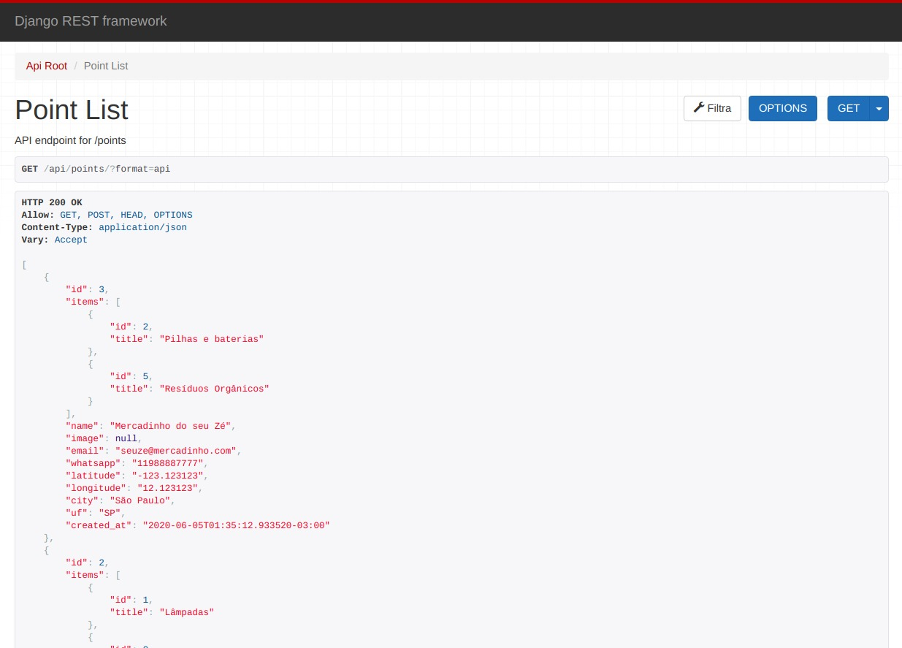
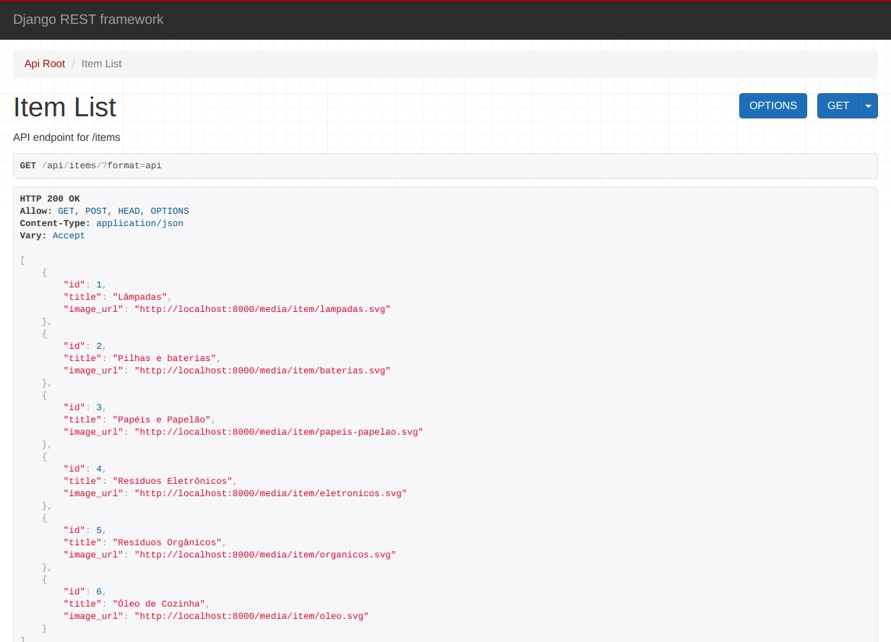

🐍 django-ecoleta-api
==============

`django-ecoleta-api` é um projeto que implementa a api feita na [Next Level Week][1] da [Rocketseat][2], porém utilizando __Django__ e __django-rest-framework__.

Como funciona
------------

Ecoleta é uma aplicação com o intuito de conectar empresas quem coletam resíduos à pessoas que buscam descartá-los.

#### Endpoints

A api possui os seguintes endpoints:

 - `/api/points/`
 - `/api/items/`

Lembrando que:
1. A api é __RESTful__, e pode receber requisições do tipo `GET, POST, PUT, PATCH e DELETE`
2. Para acessar um registro único, basta informar seu identificador, ex: `/api/points/1/`

#### Filtragem de conteúdo

É possível filtrar __pontos de coleta__ retornados através de `query parameters`

 - `/api/points?uf=PB&items=1,2`

Você pode filtrar por `name, city, uf, items`

    
      
    

  

Instalando e fazendo funcionar
--------------------

Você pode instalar `django-ecoleta-api` clonando do GitHub:

        $ git clone https://github.com/xavierigor/django-ecoleta-api.git

Ative seu virtual environment e use `make setup` para instalar todas as dependências do projeto, rodar migrações e fixtures:

        $ cd django-ecoleta-api/
        $ make setup

Agora você pode rodar o servidor local do Django e começar a fazer requisições:

        $ make run

Contribuindo
--------------------

- Faça um fork desse repo e crie sua branch a partir da `master`.
- Se você mudou a API, atualize o [README](README.md).
- Faça um pull request!

  [1]: https://nextlevelweek.com/
    "Next Level Week"
  [2]: https://rocketseat.com.br/
    "Rocketseat"
